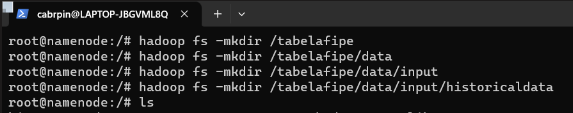
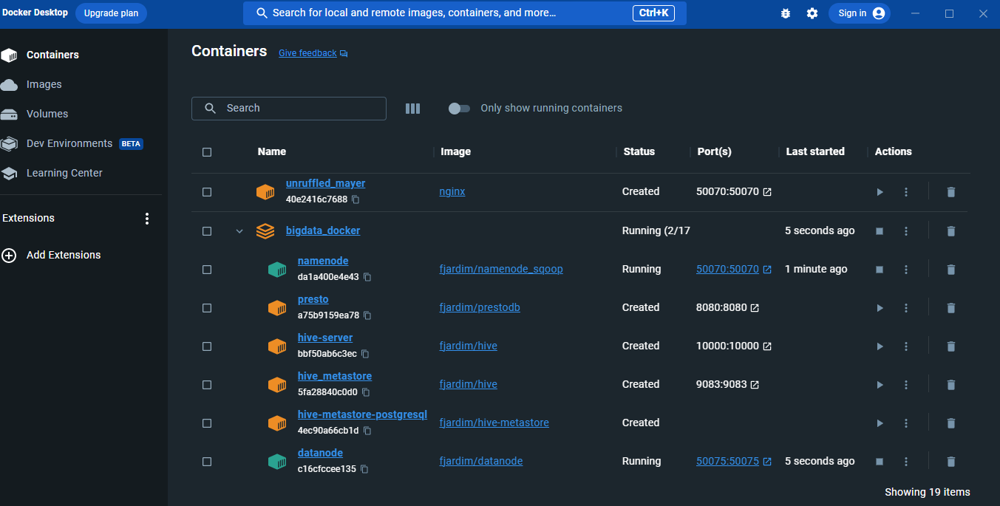
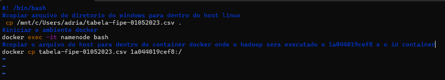
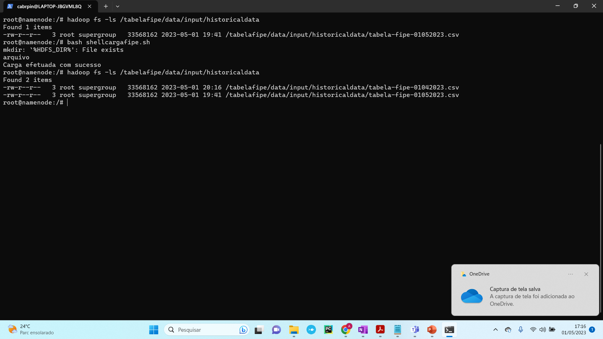

# MBA Atividade 01 - Distributed Data Processing 
<br/>

> Você vai prender a utilizar alguns do Hadoop (HDFS) com um dataset que aborda o histórico de alguns modelos da tabela [FIPE](https://veiculos.fipe.org.br/).

Escolhemos o nosso dataset no [Kaggle](https://www.kaggle.com/), é um dataset sobre o histórico de preços da tabela fipe de alguns veículos.


<hr>


## Preparando o ambiente 

Antes de iniciar, precisamos realizar o download do nosso dataset e enviar ele para o hadoop. 

Realize o download do arquivo [dataset-fipe-exemplo.zip](https://github.com/CleitonDsd/exe01_distributed_data_processing_mba/raw/main/dataset-fipe-exemplo.zip), dentro desse arquivo compactado temos o 'tabela-fipe-01052023.csv', que será utilizado nos exemplos desse tutorial, realize a extração dele na sua pasta download.


Não sabe configurar o ambiente docker? [Acesse e aprenda aqui](https://github.com/fabiogjardim/bigdata_docker).


<hr/>

## Criando a estrutura para o Dataset

> Escolhemos essa estrutura para que possamos manter a padronização dos arquivos e conseguir separá-los de acordo com o seu timestampm no nosso caso temos um repositório central que armazena todas as atualizações mensais desse histórico da tabela fipe.

Dentro do Hadoop vamos criar a estrutura para o nosso dataset, conforme a imagem abaixo: 



para isso execute os comandos a seguir, um por vez:

```sh
hadoop -fs -mkdir /tabelafipe
```
```sh
hadoop -fs -mkdir /tabelafipe/data

```
```sh
hadoop -fs -mkdir /tabelafipe/data/input

```
```sh
hadoop -fs -mkdir /tabelafipe/data/input/historicaldata

```
<br>
<hr>


## Carregando o Dataset na estrutura definida (Manualmente)

Para realizar essa atividade, é necessário se atentar a os caminhos da sua máquina, no nosso caso estamos utilizando o padrão do Windows, lembre de substituir para o caminho equivalente ao do seu usuário no seu computador.

Vamos realizar o 'UP' do nosso ambiente docker e do namenode

```sh
docker-compose up -D 
```

Certifique-se de que o ambiente está em execução de acordo com a imagem 



<hr>


Acesse o WSL do seu computador e execute os comando abaixo para levar o nosso dataset para o docker:

```sh
cp C:/Usuarios/Seu_Usuario/Downloads/tabela-fipe-01052023.csv .
```

Para acessar o namenode, conforme o comando abaixo

```sh
docker exec -it namenode bash
```

Após acessar o name node, vamos copiar o arquivo do docker para o HDFS

```sh
docker cp tabela-fipe-01052023.csv
```

Conforme a imagem abaixo: 




<hr/>

## Agora para simplificar, vamos carregar o dataset de forma semi-automatizada

> Mantenha o ambiente em execução, baixe o script 'shellcargafipe.sh', para automatizar o processo, [Baixe aqui.]([scripts/shellcargafipe.sh](https://github.com/CleitonDsd/exe01_distributed_data_processing_mba/blob/main/scripts/shellcargafipe.sh)), e em seguida o execute, o dataset também deverá ser carregado, conforme a imagem abaixo: 




### Criando Estrutura de Backup

> Nossa dataset terá a periodicidade de atualização mensal, com isso temos um script (.sh) que deve ser executado para realizar o backup toda vez que existir uma nova atualização na estrutura principal (tabelafipe/data/input/historicaldata/). 

> Com isso, o script realizará o backup dos nossos dataset para o diretório de backup, como estamos num ambiente pseudo-distribuído não conseguimos realizar atividades antes 'disaster-recovery' no momento, mas até que o ambiente permaneça em exceução dos dados atualizados, poderão ser recuperados em caso de uma exclusão e etc. 

<hr>

Nossos backups serão armazenados na estrutura "tabelafipe/data/input/historicaldata/", ao executar o 'shellbackup (scripts/shellbackup.sh)[]' ele irá criar a estrutura de backup, caso ela não exista, e irá realizar o backup dos nosso dataset para ela.  

> Mantenha o ambiente em execução, (baixe aqui)[https://github.com/CleitonDsd/exe01_distributed_data_processing_mba/blob/main/scripts/shellbackup.sh] o script 'shellbackup (scripts/shellbackup.sh)', para automatizar o processo. Em seguida, o adicione a estrurua raiz, conforme fizemos anteriormente e realize a execução, devemos ter o resultado conforme a imagem abaixo com a estrutura criada e com o backup realizado.


